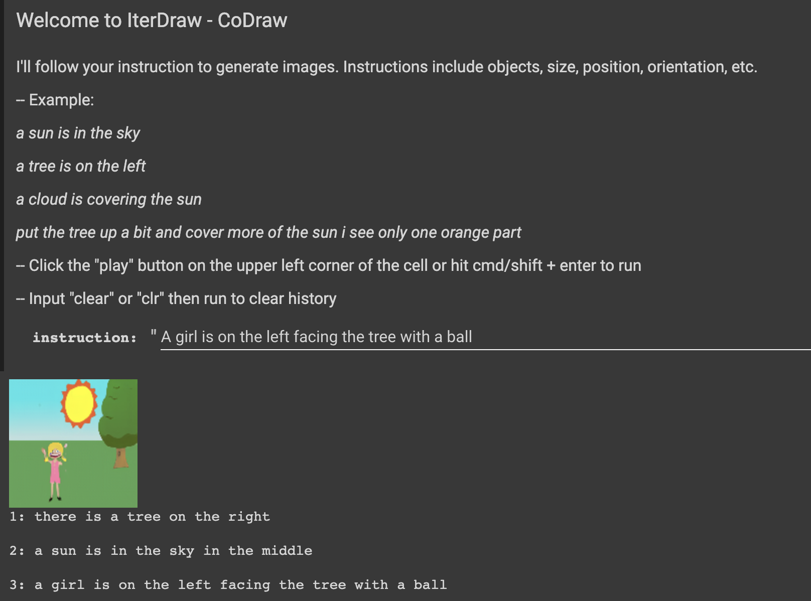

# GeNeVA-GAN for IterDraw System

This repo is based on the GeNeVA-GAN repository. In the paper of IterDraw system, we utilised the GeNeVA-GAN as the 
core generative network to iteratively complete a drawing following the user's instructions step-by-step.

On the IterDraw Colab page, click from the navigation bar Runtime - Run All, then scroll down to the last cell. Follow the 
instructions to input your instruction and the system will generate an image for each instruction you input.

| | |
:-------------------------:|:-------------------------:
| IterDraw Interface (i-CLEVR)              | IterDraw Interface (CoDraw)

This repo contains only the source code for the generative network. To access the system, please visit the Colab 
Notebook page: [IterDraw Interface (i-CLEVR)](https://colab.research.google.com/drive/13_mI5MUsIlvNGOWEy6ZSZlkDoT4abPvx?usp=sharing)
 or [IterDraw Interface (CoDraw)](https://colab.research.google.com/drive/1mafKPeZlkOykw0Pp3fleylnp2x2OiXZk?usp=sharing)
 

For more information on training your own model or adapting the system to a different dataset, please refer to the original repository. 
To better understand the netwrok, please refer to the original paper: [Tell, Draw, and Repeat: Generating and Modifying Images Based on Continual Linguistic Instruction](https://arxiv.org/abs/1811.09845).

### Microsoft Open Source Code of Conduct ###
This project welcomes contributions and suggestions. Most contributions require you to
agree to a Contributor License Agreement (CLA) declaring that you have the right to,
and actually do, grant us the rights to use your contribution. For details, visit
https://cla.microsoft.com.

When you submit a pull request, a CLA-bot will automatically determine whether you need
to provide a CLA and decorate the PR appropriately (e.g., label, comment). Simply follow the
instructions provided by the bot. You will only need to do this once across all repositories using our CLA.

This project has adopted the [Microsoft Open Source Code of Conduct](https://opensource.microsoft.com/codeofconduct/).
For more information see the [Code of Conduct FAQ](https://opensource.microsoft.com/codeofconduct/faq/)
or contact [opencode@microsoft.com](mailto:opencode@microsoft.com) with any additional questions or comments.

### License ###
See [LICENSE.txt](LICENSE.txt). For Third Party Notices, see [NOTICE.txt](NOTICE.txt).
